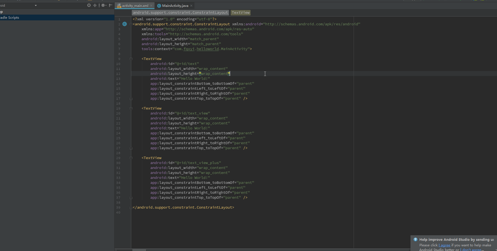

# ButterKnifeCode

# 描述

A plugin for android developer, with the plugin you can generate "ButterKnife" code quickly, For Example:

- In App Module : "@BindView(R.id.viewTest) LinearLayout viewTest"
- In Library Module : "@BindView(R2.id.viewTest) LinearLayout viewTest"

# 功能

1. Support generate "ButterKnife" code in Code.
2. Support generate "ButterKnife" code in Layout.

# JAR

[ButterKnifeCode.jar](ButterKnifeCode.jar)

# 效果展示

# 参考链接

- [学会编写Android Studio插件 别停留在用的程度了](http://blog.csdn.net/lmj623565791/article/details/51548272)
- [FindViewByMe](https://github.com/laobie/FindViewByMe)
